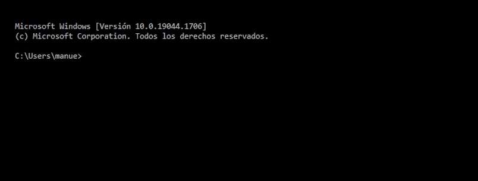

# utils-jq.jq

Useful functions for jq

  * [What is it JQ](#what-is-it-jq)
  * [How do I install this?](#how-do-i-install-this)
  * [How to start testing the functions?](#how-to-start-testing-the-functions)
  * [Recommended development environments (IDE)](#recommended-development-environments-ide)

## What is it JQ?

[jq](https://stedolan.github.io/jq/) is a great tool for query processing on JSON files, 
the [utils-jq.jq](https://github.com/manuel-chinchi/utils-jq/blob/master/src/utils-jq.jq) file
found in this repository contains several functions in `jq` syntax that can be used within 
your custom queries.

## How do I install this?
Very easy, just follow these steps  
  1. First, you have to install the jq.exe binary on your system, for that you have to 
    download the [setup.py](https://github.com/manuel-chinchi/utils-jq/blob/master/jq/setup.py)
    file and run it on your computer.
    If you want you can check that the installation has been done correctly by opening a 
    terminal and executing `jq --version`, you should see an output similar to this:
    ```
    jq-1.6
    ```
  2. Now you must download and run the [setup.py](https://github.com/manuel-chinchi/utils-jq/blob/master/setup.py) 
    file to install the [utils-jq.jq](https://github.com/manuel-chinchi/utils-jq/blob/master/src/utils-jq.jq) file itself.
  3. You should now be able to test the functions of the library, see the following section below
    **"How to start testing the functions?"**

## How to start testing the functions?
If you have already run the [installer](https://github.com/manuel-chinchi/utils-jq/blob/master/jq/setup.py) 
for jq.exe and also the [installer](https://github.com/manuel-chinchi/utils-jq/blob/master/setup.py) 
for the utils-jq.jq library, then you only have to test that everything is working by 
opening a terminal and running the following command
```bash
jq -n "include \"utils-jq\"; \"hello world\" | text_format(\"capit\")"
```
You should see an output similar to this
```
Hello World
```
You can be guided by the following animation 


## Recommended development environments (IDE)
I recommend using one of these environments, which I use for development, if you are going to test.
  * [Sublime Text](https://www.sublimetext.com/)  
    * [JQ Syntax](https://packagecontrol.io/packages/JQ%20Syntax) for syntax highlighting
    * [Package Control](https://packagecontrol.io/) for packet control

  * [Visual Studio Code](https://code.visualstudio.com/)  
    * [JQ Syntax Highlighting](https://marketplace.visualstudio.com/items?itemName=jq-syntax-highlighting.jq-syntax-highlighting) for syntax highlighting
    * [Git Lens](https://marketplace.visualstudio.com/items?itemName=eamodio.gitlens) for change control